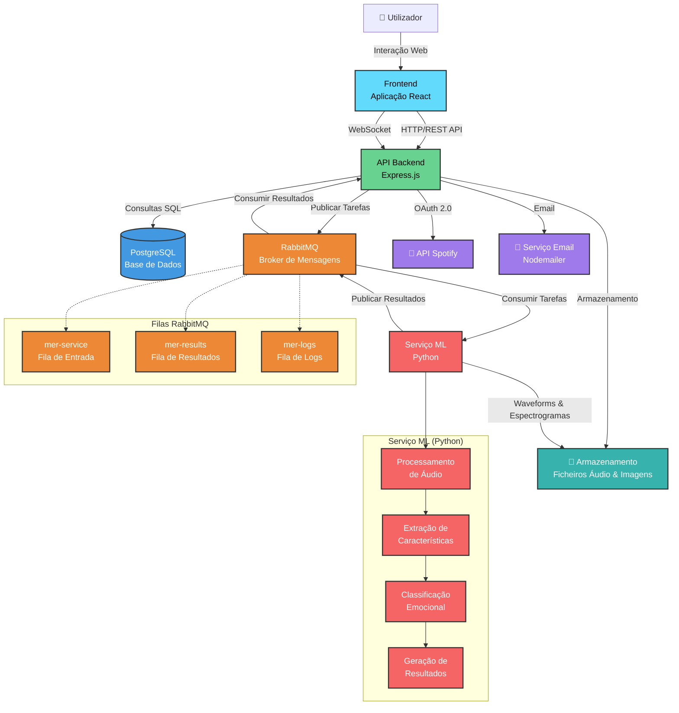

```mermaid
graph TD
    %% User Interface Layer
    User[👤 Utilizador] -->|Interação Web| Frontend[Frontend<br/>Aplicação React]
    
    %% Frontend Details
    Frontend -->|HTTP/REST API| API[API Backend<br/>Express.js]
    Frontend -->|WebSocket| API
    
    %% Data Layer
    API -->|Consultas SQL| Database[(PostgreSQL<br/>Base de Dados)]
    
    %% Message Broker Layer
    API -->|Publicar Tarefas| RabbitMQ[RabbitMQ<br/>Broker de Mensagens]
    RabbitMQ -->|Consumir Tarefas| MLService[Serviço ML<br/>Python]
    MLService -->|Publicar Resultados| RabbitMQ
    RabbitMQ -->|Consumir Resultados| API
    
    %% ML Service Details
    subgraph MLGroup["Serviço ML (Python)"]
        AudioProcessor[Processamento<br/>de Áudio]
        FeatureExtractor[Extração de<br/>Características]
        EmotionClassifier[Classificação<br/>Emocional]
        ResultGenerator[Geração de<br/>Resultados]
        
        AudioProcessor --> FeatureExtractor
        FeatureExtractor --> EmotionClassifier
        EmotionClassifier --> ResultGenerator
    end
    
    MLService --> AudioProcessor
    
    %% External Services
    API -->|OAuth 2.0| Spotify[🎵 API Spotify]
    API -->|Email| SMTP[📧 Serviço Email<br/>Nodemailer]
    
    %% Storage
    API -->|Armazenamento| SharedStorage[📁 Armazenamento<br/>Ficheiros Áudio & Imagens]
    MLService -->|Waveforms & Espectrogramas| SharedStorage
    
    %% Queue Details
    subgraph QueueGroup["Filas RabbitMQ"]
        InputQueue[mer-service<br/>Fila de Entrada]
        ResultQueue[mer-results<br/>Fila de Resultados]
        LogQueue[mer-logs<br/>Fila de Logs]
    end
    
    RabbitMQ -.-> InputQueue
    RabbitMQ -.-> ResultQueue
    RabbitMQ -.-> LogQueue
    
    %% Styling
    classDef frontendStyle fill:#61dafb,stroke:#333,stroke-width:2px,color:#000
    classDef backendStyle fill:#68d391,stroke:#333,stroke-width:2px,color:#000
    classDef databaseStyle fill:#4299e1,stroke:#333,stroke-width:2px,color:#fff
    classDef mlStyle fill:#f56565,stroke:#333,stroke-width:2px,color:#fff
    classDef queueStyle fill:#ed8936,stroke:#333,stroke-width:2px,color:#fff
    classDef externalStyle fill:#9f7aea,stroke:#333,stroke-width:2px,color:#fff
    classDef storageStyle fill:#38b2ac,stroke:#333,stroke-width:2px,color:#fff
    
    class Frontend frontendStyle
    class API backendStyle
    class Database databaseStyle
    class MLService,AudioProcessor,FeatureExtractor,EmotionClassifier,ResultGenerator mlStyle
    class RabbitMQ,InputQueue,ResultQueue,LogQueue queueStyle
    class Spotify,SMTP externalStyle
    class SharedStorage storageStyle
```
